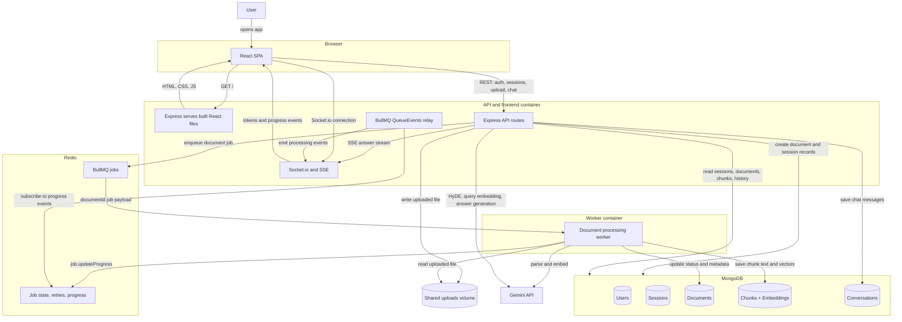

# Talk to My Doc

Talk to My Doc is an authenticated RAG application for uploading documents and chatting with their contents. A session can contain multiple documents, and questions are answered using retrieval across all ready documents in the selected session.

The app uses React/Vite on the frontend, Express/MongoDB on the backend, Redis/BullMQ for persistent document-processing jobs, and Gemini for embeddings and chat generation.

## Features

- Login, signup, logout, and bearer-token protected API routes
- Multi-document chat sessions
- PDF, DOCX, and TXT uploads
- Persistent Redis/BullMQ document-processing queue
- Separate worker process for parsing, semantic chunking, and embeddings
- Real-time document processing updates through Socket.io
- Chat streaming through Server-Sent Events
- Semantic chunking with Gemini embeddings and cosine-similarity breakpoints
- Hybrid retrieval with vector similarity, MongoDB text search, and RRF fusion
- HyDE query expansion for better retrieval on vague questions
- Conversation history restored when switching sessions
- Docker multi-stage production build with separate API and worker targets

## Tech Stack

| Layer | Technology |
| --- | --- |
| Frontend | React 19, Vite 8, React Router |
| Backend | Node.js, Express |
| Database | MongoDB Atlas, Mongoose |
| Queue | Redis, BullMQ |
| Realtime | Socket.io, SSE |
| Auth | Custom signed bearer token, hashed passwords |
| AI | Google Gemini API |
| Embeddings | `gemini-embedding-2` |
| Chat | `gemini-3.5-flash` with fallback models |
| File parsing | `pdf-parse`, `mammoth` |

## Architecture



Redis is only used for BullMQ queue/runtime state: pending jobs, active jobs, retries, failures, and progress. Processed document data, chunks, embeddings, sessions, users, and chat history are persisted in MongoDB. When API and worker run as separate containers, `server/uploads` must be mounted as a shared volume so the worker can read files uploaded by the API container.

## How It Works

1. A user signs up or logs in.
2. The user creates or selects a session.
3. Uploading a document attaches it to the selected session. If no session is selected, a new session is created.
4. The API stores the file metadata in MongoDB and enqueues a BullMQ job.
5. The worker parses the file, creates semantic chunks, generates embeddings, and stores chunks in MongoDB.
6. The chatbox unlocks when the selected session has at least one document and all documents in that session are ready.
7. A chat question retrieves relevant chunks from every ready document in the session.
8. Gemini generates a grounded answer, streamed back to the client over SSE.
9. Conversation history is saved and restored when switching sessions.

## Project Structure

```txt
talk-to-my-doc/
├── Dockerfile
├── .dockerignore
├── .env.example
├── README.md
├── client/
│   ├── src/
│   │   ├── components/
│   │   ├── context/
│   │   ├── hooks/
│   │   ├── pages/
│   │   └── services/
│   ├── package.json
│   └── vite.config.js
└── server/
    ├── app.js
    ├── server.js
    ├── worker.js
    ├── config/
    ├── controllers/
    ├── middleware/
    ├── models/
    ├── queues/
    ├── routes/
    ├── services/
    └── package.json
```

## Data Model

| Model | Purpose |
| --- | --- |
| `User` | Authenticated user account |
| `Session` | User-owned chat session; can contain multiple documents |
| `Document` | Uploaded file metadata, status, processing metrics, `sessionId` |
| `Chunk` | Text chunk, embedding vector, sentence range, `documentId` |
| `Conversation` | Session-scoped chat messages and title |

Legacy single-document chat routes still exist, but the active UI uses session-scoped chat.

## API Overview

### Auth

| Method | Endpoint | Description |
| --- | --- | --- |
| `POST` | `/api/auth/signup` | Create account |
| `POST` | `/api/auth/login` | Login |
| `GET` | `/api/auth/me` | Current user |
| `POST` | `/api/auth/logout` | Logout |

### Sessions

| Method | Endpoint | Description |
| --- | --- | --- |
| `GET` | `/api/sessions` | List current user's sessions with documents |
| `POST` | `/api/sessions` | Create an empty session |
| `GET` | `/api/sessions/:id` | Get one session with documents |
| `DELETE` | `/api/sessions/:id` | Delete session, documents, chunks, conversations, and files |

### Documents

| Method | Endpoint | Description |
| --- | --- | --- |
| `POST` | `/api/documents/upload` | Upload a document; optional `sessionId` form field |
| `GET` | `/api/documents` | List current user's documents |
| `GET` | `/api/documents/:id` | Get document details |
| `DELETE` | `/api/documents/:id` | Delete one document and its chunks |

### Chat

| Method | Endpoint | Description |
| --- | --- | --- |
| `POST` | `/api/chat/sessions/:sessionId` | Chat across all documents in a session via SSE |
| `GET` | `/api/chat/sessions/:sessionId/conversations` | List session conversations |
| `GET` | `/api/chat/conversations/:conversationId` | Get conversation history |
| `DELETE` | `/api/chat/conversations/:conversationId` | Delete conversation |
| `POST` | `/api/chat/:documentId` | Legacy single-document chat |

## Environment Variables

Create `server/.env`:

```env
# Server
PORT=5001
CLIENT_ORIGIN=http://localhost:5173
MONGODB_URI=mongodb+srv://<user>:<pass>@cluster.mongodb.net/talk-to-my-doc

# Redis / BullMQ
REDIS_URL=redis://127.0.0.1:6379
DOCUMENT_WORKER_CONCURRENCY=1
DOCUMENT_JOB_ATTEMPTS=5
DOCUMENT_JOB_BACKOFF_MS=15000

# Gemini
GEMINI_API_KEY=AIza...
GEMINI_EMBEDDING_MODEL=gemini-embedding-2
GEMINI_EMBEDDING_DIMENSIONS=768
GEMINI_EMBEDDING_TASK_TYPE=RETRIEVAL_DOCUMENT
GEMINI_QUERY_EMBEDDING_TASK_TYPE=RETRIEVAL_QUERY
GEMINI_EMBEDDING_RETRIES=4
GEMINI_EMBEDDING_RETRY_BASE_MS=1500
GEMINI_CHAT_MODEL=gemini-3.5-flash
GEMINI_CHAT_FALLBACK_MODELS=gemini-3.1-flash-lite,gemini-2.5-flash
GEMINI_HYDE_MODEL=gemini-3.1-flash-lite

# RAG
SEMANTIC_CHUNK_THRESHOLD_K=1.0
CONVERSATION_MEMORY_LIMIT=10
ENABLE_HYDE=true
ENABLE_HYBRID_SEARCH=true
```

For local Vite development, create `client/.env` if needed:

```env
VITE_API_URL=http://localhost:5001/api
VITE_SOCKET_URL=http://localhost:5001
```

## Local Development

Prerequisites:

- Node.js 22+
- MongoDB Atlas connection string
- Redis running locally
- Gemini API key

Install dependencies:

```bash
cd server
npm install

cd ../client
npm install
```

Start Redis:

```bash
brew services start redis
redis-cli ping
```

Start the API:

```bash
cd server
npm run dev
```

Start the worker in another terminal:

```bash
cd server
npm run worker:dev
```

Start the frontend in another terminal:

```bash
cd client
npm run dev
```

Open:

```txt
http://localhost:5173
```

Health check:

```bash
curl http://localhost:5001/api/health
```

## Docker

The root `Dockerfile` is multi-stage:

- `client-deps`: installs client dependencies
- `client-build`: builds the Vite app
- `server-deps`: installs production server dependencies
- `runner`: runs Express and serves the built React app
- `worker`: runs the BullMQ document worker

Build the API/frontend image:

```bash
docker build -t talk-to-my-doc-api .
```

Build the worker image:

```bash
docker build --target worker -t talk-to-my-doc-worker .
```

Create the shared upload volume:

```bash
docker volume create talk-to-my-doc-uploads
```

Run API/frontend:

```bash
docker run \
  --env-file server/.env \
  -p 5001:5001 \
  -v talk-to-my-doc-uploads:/app/server/uploads \
  talk-to-my-doc-api
```

Run worker:

```bash
docker run \
  --env-file server/.env \
  -v talk-to-my-doc-uploads:/app/server/uploads \
  talk-to-my-doc-worker
```

If Redis is running on your host machine and the app is inside Docker, set:

```env
REDIS_URL=redis://host.docker.internal:6379
```

For production, run API and worker as separate containers using the same environment variables and the same upload volume. MongoDB Atlas can remain external.

## RAG Pipeline

### Ingestion

```txt
upload
  -> store file with Multer
  -> enqueue BullMQ job
  -> parse text from PDF/DOCX/TXT
  -> split into sentences
  -> embed sentences
  -> detect semantic breakpoints by cosine similarity drops
  -> create bounded semantic chunks
  -> embed final chunks
  -> store chunks in MongoDB
  -> mark document ready
```

### Query

```txt
question
  -> load session conversation memory
  -> optional HyDE expansion
  -> embed query
  -> retrieve chunks across all session documents
  -> combine vector + text search with RRF
  -> build grounded Gemini prompt
  -> stream answer through SSE
  -> save conversation messages
```

## Current Limits

- Upload max size is 20 MB.
- Worker concurrency defaults to `1` to avoid exhausting Gemini quota.
- Semantic chunking embeds sentences, so very large documents can consume a lot of embedding quota.
- Retrieval currently computes vector similarity in application code over MongoDB chunks. For large deployments, move to MongoDB Atlas Vector Search or another vector index.
- Scanned/image-only PDFs are not OCR-supported yet.

## Useful Commands

```bash
# Client production build
cd client && npm run build

# Server syntax check example
node --check server/app.js

# Start API
cd server && npm run dev

# Start worker
cd server && npm run worker:dev
```

## License

ISC
