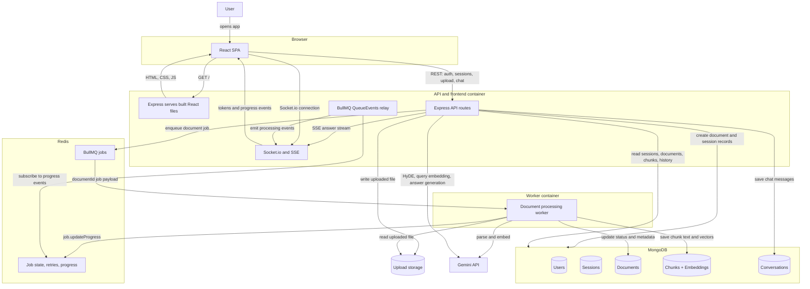
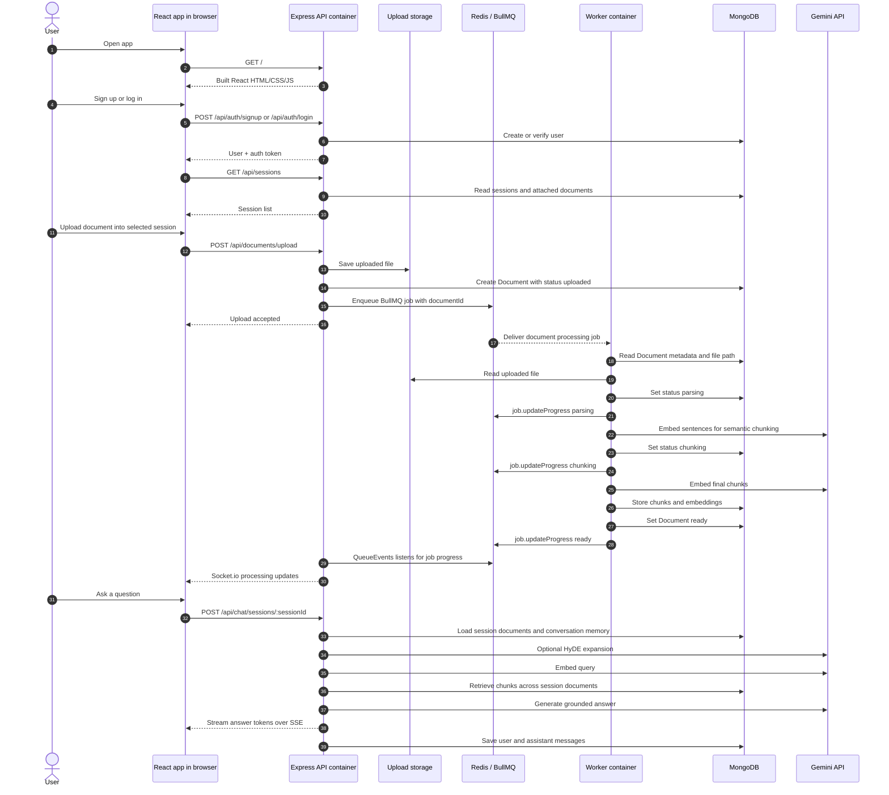

# Talk to My Doc

Talk to My Doc is an authenticated RAG application for uploading documents and chatting with their contents. A session can contain multiple documents, and questions are answered using retrieval across all ready documents in the selected session.

The app uses React/Vite on the frontend, Express/MongoDB on the backend, Redis/BullMQ for persistent document-processing jobs, and Gemini for embeddings and chat generation.

## Features

- Login, signup, logout, and JWT bearer-token protected API routes
- Zod-backed signup/signin validation with normalized email/name input
- Multi-document chat sessions
- PDF, DOCX, and TXT uploads
- Client and server upload validation for file type, empty files, and 20 MB max size
- Persistent Redis/BullMQ document-processing queue
- Separate worker process for parsing, semantic chunking, and embeddings
- Real-time document processing updates through Socket.io
- Chat streaming through Server-Sent Events
- Semantic chunking with Gemini embeddings and cosine-similarity breakpoints
- Hybrid retrieval with vector similarity, MongoDB text search, and RRF fusion
- HyDE query expansion for better retrieval on vague questions
- Follow-up query rewriting for better retrieval across conversation turns
- Dynamic retrieval depth based on question type
- Conversation history restored when switching sessions
- Selected-session document list with per-document delete and retry controls
- Guardrails for invalid IDs, duplicate processing retries, empty retrieval results, and too-long questions
- Docker multi-stage production build with separate API and worker targets

## Tech Stack

| Layer | Technology |
| --- | --- |
| Frontend | React 19, Vite 8, React Router |
| Backend | Node.js, Express |
| Database | MongoDB Atlas, Mongoose |
| Queue | Redis, BullMQ |
| Realtime | Socket.io, SSE |
| Auth | JWT bearer tokens, hashed passwords, Zod validation |
| AI | Google Gemini API |
| Embeddings | `gemini-embedding-2` |
| Chat | `gemini-3.5-flash` with fallback models |
| File parsing | `pdf-parse`, `mammoth` |

## Architecture



Redis is only used for BullMQ queue/runtime state: pending jobs, active jobs, retries, failures, and progress. Processed document data, chunks, embeddings, sessions, users, and chat history are persisted in MongoDB. Uploaded files can be stored on local disk for development or in MongoDB GridFS for separate API/worker services without a shared filesystem.

## End-to-End Flow



### Step-by-Step Runtime Flow

1. A user signs up or logs in.
2. The browser stores the returned JWT bearer token and sends it on future API and SSE requests.
3. The browser loads the user's sessions from `/api/sessions`.
4. The user selects an existing session or starts with no selected session.
5. When the user uploads a document, the browser sends the file to `/api/documents/upload`.
6. If a session is selected, the uploaded document is attached to that session. If no session is selected, the API creates a new session first.
7. The API saves the raw file into upload storage. Use `UPLOAD_STORAGE=local` for local disk or `UPLOAD_STORAGE=gridfs` for MongoDB GridFS.
8. The API creates a `Document` record in MongoDB with status `uploaded`.
9. The API enqueues a BullMQ job in Redis containing the `documentId`.
10. The worker receives the job from Redis and loads the document metadata from MongoDB.
11. The worker reads the uploaded file from upload storage.
12. The worker extracts text from PDF, DOCX, or TXT.
13. The worker updates document status to `parsing`, `chunking`, `embedding`, and finally `ready`.
14. During processing, the worker writes BullMQ job progress to Redis.
15. The API process listens to BullMQ `QueueEvents` and relays progress to the browser with Socket.io.
16. For semantic chunking, the worker splits text into sentences, embeds sentences with Gemini, finds cosine-similarity drops, and groups sentences into coherent chunks.
17. The worker embeds the final chunks with Gemini.
18. The worker stores chunk text, embeddings, token counts, and document processing metadata in MongoDB.
19. The chatbox unlocks when the selected session has at least one document and every document in that session is `ready`.
20. When the user asks a question, the browser posts to `/api/chat/sessions/:sessionId`.
21. The API loads the session's documents and recent conversation memory from MongoDB.
22. If HyDE is enabled, the API asks Gemini to generate a hypothetical answer and embeds that for better retrieval.
23. The API embeds the query, retrieves matching chunks across all documents in the session, and merges vector plus keyword results with RRF.
24. The API sends the retrieved context, conversation memory, and user question to Gemini.
25. Gemini's answer is streamed back to the browser over SSE.
26. The API saves the user question and assistant answer in MongoDB so the chat reappears when switching sessions.

## Project Structure

```txt
talk-to-my-doc/
├── Dockerfile
├── .dockerignore
├── .env.example
├── README.md
├── client/
│   ├── src/
│   │   ├── components/
│   │   ├── context/
│   │   ├── hooks/
│   │   ├── pages/
│   │   └── services/
│   ├── package.json
│   └── vite.config.js
└── server/
    ├── app.js
    ├── server.js
    ├── worker.js
    ├── config/
    ├── controllers/
    ├── middleware/
    ├── models/
    ├── queues/
    ├── routes/
    ├── schemas/
    ├── services/
    ├── utils/
    └── package.json
```

## Data Model

| Model | Purpose |
| --- | --- |
| `User` | Authenticated user account |
| `Session` | User-owned chat session; can contain multiple documents |
| `Document` | Uploaded file metadata, status, processing metrics, `sessionId` |
| `Chunk` | Text chunk, embedding vector, sentence range, `documentId` |
| `Conversation` | Session-scoped chat messages and title |

Legacy single-document chat routes still exist, but the active UI uses session-scoped chat.

## API Overview

### Auth

| Method | Endpoint | Description |
| --- | --- | --- |
| `POST` | `/api/auth/signup` | Create account |
| `POST` | `/api/auth/login` | Login |
| `POST` | `/api/auth/signin` | Login alias |
| `GET` | `/api/auth/me` | Current user |
| `POST` | `/api/auth/logout` | Logout |

### Sessions

| Method | Endpoint | Description |
| --- | --- | --- |
| `GET` | `/api/sessions` | List current user's sessions with documents |
| `POST` | `/api/sessions` | Create an empty session |
| `GET` | `/api/sessions/:id` | Get one session with documents |
| `DELETE` | `/api/sessions/:id` | Delete session, documents, chunks, conversations, and files |

### Documents

| Method | Endpoint | Description |
| --- | --- | --- |
| `POST` | `/api/documents/upload` | Upload a document; optional `sessionId` form field |
| `GET` | `/api/documents` | List current user's documents |
| `GET` | `/api/documents/:id` | Get document details |
| `POST` | `/api/documents/:id/retry` | Retry processing for one document |
| `DELETE` | `/api/documents/:id` | Delete one document and its chunks |

### Chat

| Method | Endpoint | Description |
| --- | --- | --- |
| `POST` | `/api/chat/sessions/:sessionId` | Chat across all documents in a session via SSE |
| `GET` | `/api/chat/sessions/:sessionId/conversations` | List session conversations |
| `GET` | `/api/chat/conversations/:conversationId` | Get conversation history |
| `DELETE` | `/api/chat/conversations/:conversationId` | Delete conversation |
| `POST` | `/api/chat/:documentId` | Legacy single-document chat |

## Validation and Edge Cases

### Auth

- Signup and signin use shared Zod rules on the frontend and backend.
- Names are trimmed, internal whitespace is collapsed, and length is limited.
- Emails are trimmed and lowercased before storage/login.
- Passwords must be 8-128 characters and include at least one letter and one number.
- Login failures return a generic invalid-credentials message.
- Duplicate email races are returned as `409`.
- Bearer tokens are parsed case-insensitively and extra spaces are tolerated.

### Uploads and Processing

- Supported uploads: PDF, DOCX, TXT.
- Maximum upload size: 20 MB.
- Empty files are rejected.
- Invalid or missing `sessionId` values return clean `400` or `404` responses.
- Rejected local uploads are cleaned up so failed requests do not leave orphan files.
- Processing clears stale errors and chunk counts before retrying.
- Retry is blocked while a document is already queued or processing.
- Processing fails clearly if no text, no chunks, or mismatched embeddings are produced.
- Deleting a document is blocked after chat has started for that document/session.

### Chat

- Chat requires a valid document/session/conversation ID before SSE starts.
- Question text is trimmed and limited by `MAX_QUESTION_LENGTH`, default `4000`.
- Empty questions are rejected.
- If retrieval finds no chunks or the model returns no text, the API returns a clear stream error.
- The frontend converts SSE errors into a completed failed assistant message instead of leaving the message loading.

## Environment Variables

Create `server/.env`:

```env
# Server
NODE_ENV=production
PORT=5001
SERVE_CLIENT=false
CLIENT_ORIGIN=https://your-frontend-domain.example
MONGODB_URI=mongodb+srv://<user>:<pass>@cluster.mongodb.net/talk-to-my-doc
JWT_SECRET=replace-with-a-long-random-secret
JWT_EXPIRES_IN=7d

# Upload storage
# Use gridfs when API and worker run as separate services without a shared disk.
UPLOAD_STORAGE=gridfs

# Redis / BullMQ
REDIS_URL=redis://<user>:<pass>@<host>:<port>
DOCUMENT_WORKER_CONCURRENCY=1
DOCUMENT_JOB_ATTEMPTS=5
DOCUMENT_JOB_BACKOFF_MS=15000

# Gemini
GEMINI_API_KEY=<gemini-api-key>
GEMINI_EMBEDDING_MODEL=gemini-embedding-2
GEMINI_EMBEDDING_DIMENSIONS=768
GEMINI_EMBEDDING_TASK_TYPE=RETRIEVAL_DOCUMENT
GEMINI_QUERY_EMBEDDING_TASK_TYPE=RETRIEVAL_QUERY
GEMINI_EMBEDDING_RETRIES=4
GEMINI_EMBEDDING_RETRY_BASE_MS=1500
GEMINI_EMBEDDING_BATCH_SIZE=100
GEMINI_CHAT_MODEL=gemini-3.5-flash
GEMINI_CHAT_FALLBACK_MODELS=gemini-3.1-flash-lite,gemini-2.5-flash
GEMINI_HYDE_MODEL=gemini-3.1-flash-lite
GEMINI_QUERY_REWRITE_MODEL=gemini-3.1-flash-lite

# RAG
SEMANTIC_CHUNK_THRESHOLD_K=1.0
SEMANTIC_UNIT_TARGET_TOKENS=140
SEMANTIC_UNIT_MAX_SENTENCES=8
MAX_CHUNK_TOKENS=800
MIN_CHUNK_TOKENS=50
CHUNK_INSERT_BATCH_SIZE=500
CONVERSATION_MEMORY_LIMIT=10
RAG_TOP_K_FACTUAL=6
RAG_TOP_K_DEFAULT=8
RAG_TOP_K_BROAD=12
RAG_TOP_K_COMPARE=14
ENABLE_QUERY_REWRITE=true
ENABLE_HYDE=true
ENABLE_HYBRID_SEARCH=true
MAX_QUESTION_LENGTH=4000
```

For separate frontend/backend deployment, set these frontend build variables:

```env
VITE_API_URL=https://your-backend-domain.example/api
VITE_SOCKET_URL=https://your-backend-domain.example
```

For local Vite development, create `client/.env` if needed:

```env
VITE_API_URL=http://localhost:5001/api
VITE_SOCKET_URL=http://localhost:5001
```

For same-origin Docker/API deployments, keep the Dockerfile defaults:

```env
VITE_API_URL=/api
VITE_SOCKET_URL=
```

## Local Development

Prerequisites:

- Node.js 22+
- MongoDB Atlas connection string
- Redis running locally
- Gemini API key

Install dependencies:

```bash
cd server
npm install

cd ../client
npm install
```

Start Redis:

```bash
brew services start redis
redis-cli ping
```

Start the API:

```bash
cd server
npm run dev
```

Start the worker in another terminal:

```bash
cd server
npm run worker:dev
```

Start the frontend in another terminal:

```bash
cd client
npm run dev
```

Open:

```txt
http://localhost:5173
```

Health check:

```bash
curl http://localhost:5001/api/health
```

## No-Docker Deployment

For separate frontend and backend hosting, deploy this as three runtime services plus two managed data services:

| Service | Root directory | Build command | Start command |
| --- | --- | --- | --- |
| Frontend static site | `client` | `npm ci && npm run build` | publish `dist` |
| API web service | `server` | `npm ci --omit=dev` | `npm start` |
| Document worker/background service | `server` | `npm ci --omit=dev` | `npm run worker` |
| MongoDB | managed service | n/a | use `MONGODB_URI` |
| Redis | managed service | n/a | use `REDIS_URL` |

Set frontend build environment variables:

```env
VITE_API_URL=https://your-backend-domain.example/api
VITE_SOCKET_URL=https://your-backend-domain.example
```

Set API and worker environment variables from `.env.example`. Important production values:

```env
NODE_ENV=production
SERVE_CLIENT=false
CLIENT_ORIGIN=https://your-frontend-domain.example
UPLOAD_STORAGE=gridfs
MONGODB_URI=mongodb+srv://...
REDIS_URL=redis://...
GEMINI_API_KEY=...
JWT_SECRET=...
```

`UPLOAD_STORAGE=gridfs` is important when the API and worker are different services. The API stores uploaded files in MongoDB GridFS, and the worker reads them from MongoDB, so no shared disk or Docker volume is required.

If you run the API and worker on the same VPS with a shared filesystem, you can use `UPLOAD_STORAGE=local`, but this is not safe on most PaaS deployments because service filesystems are isolated and often ephemeral.

### Vercel Frontend + Render Backend

Recommended setup:

1. Deploy the backend on Render first.
2. Deploy the frontend on Vercel after you know the Render API URL.
3. Return to Render and set `CLIENT_ORIGIN` to the final Vercel production URL.

Render:

- Use `render.yaml` from the repo root as a Blueprint.
- It creates:
  - `talk-to-my-doc-api` as a Node web service.
  - `talk-to-my-doc-worker` as a Node background worker.
  - `talk-to-my-doc-redis` as Render Key Value for BullMQ.
- Fill dashboard prompts for:
  - `CLIENT_ORIGIN`: `https://your-vercel-app.vercel.app`
  - `MONGODB_URI`
  - `GEMINI_API_KEY`
- Keep `UPLOAD_STORAGE=gridfs` so API and worker do not need shared files.

If Render asks for a paid worker or payment method, use `render-free.yaml` instead. It runs the API and document worker inside one Free web service with `npm run start:all`, plus one Free Render Key Value instance. This is fine for demos and hobby use, but the worker sleeps when the free web service spins down.

Vercel:

- Import the same Git repo.
- Set project root directory to `client`.
- Framework preset: Vite.
- Build command: `npm run build`.
- Output directory: `dist`.
- Add environment variables:

```env
VITE_API_URL=https://your-render-api.onrender.com/api
VITE_SOCKET_URL=https://your-render-api.onrender.com
```

After both deploys:

- Open `https://your-render-api.onrender.com/api/health` and confirm it returns healthy JSON.
- In Vercel, trigger a redeploy after setting `VITE_API_URL` and `VITE_SOCKET_URL`.
- In Render, confirm the worker logs show `Document worker running`.

## Docker

The root `Dockerfile` is multi-stage:

- `client-deps`: installs client dependencies
- `client-build`: builds the Vite app
- `server-deps`: installs production server dependencies
- `runner`: runs Express and serves the built React app
- `worker`: runs the BullMQ document worker

Build the API/frontend image:

```bash
docker build -t talk-to-my-doc-api .
```

Build the worker image:

```bash
docker build --target worker -t talk-to-my-doc-worker .
```

If using `UPLOAD_STORAGE=local`, create the shared upload volume:

```bash
docker volume create talk-to-my-doc-uploads
```

Run API/frontend:

```bash
docker run \
  --env-file server/.env \
  -p 5001:5001 \
  -v talk-to-my-doc-uploads:/app/server/uploads \
  talk-to-my-doc-api
```

Run worker:

```bash
docker run \
  --env-file server/.env \
  -v talk-to-my-doc-uploads:/app/server/uploads \
  talk-to-my-doc-worker
```

If using `UPLOAD_STORAGE=gridfs`, the upload volume mount is not required because API and worker read/write files through MongoDB GridFS.

If Redis is running on your host machine and the app is inside Docker, set:

```env
REDIS_URL=redis://host.docker.internal:6379
```

For production, run API and worker as separate containers using the same environment variables. MongoDB Atlas and Redis can remain external.

## RAG Pipeline

### Ingestion

```txt
upload
  -> store file with Multer
  -> enqueue BullMQ job
  -> parse text from PDF/DOCX/TXT
  -> split into sentences
  -> pack sentences into semantic units
  -> embed semantic units in batches
  -> detect semantic breakpoints by cosine similarity drops
  -> create bounded semantic chunks
  -> embed final chunks in batches
  -> store chunks in MongoDB in insert batches
  -> mark document ready
```

### Query

```txt
question
  -> load session conversation memory
  -> classify question type
  -> rewrite follow-up questions into standalone retrieval queries
  -> optional HyDE expansion for short/definition-style questions
  -> embed retrieval query
  -> retrieve chunks across all session documents
  -> combine vector + text search with RRF
  -> choose top-K dynamically by question type
  -> build grounded Gemini prompt
  -> stream answer through SSE
  -> save conversation messages
```

## Current Limits

- Upload max size is 20 MB.
- Chat question max length defaults to 4000 characters.
- Worker concurrency defaults to `1` to avoid exhausting Gemini quota.
- Semantic chunking embeds sentence groups called semantic units, not every individual sentence. Tune `SEMANTIC_UNIT_TARGET_TOKENS` and `SEMANTIC_UNIT_MAX_SENTENCES` for cost vs. boundary precision.
- Retrieval currently computes vector similarity in application code with a MongoDB cursor and top-K heap. For very large deployments, move to MongoDB Atlas Vector Search or another vector index.
- Scanned/image-only PDFs are not OCR-supported yet.
- API and worker should use `UPLOAD_STORAGE=gridfs` when deployed as separate services.

## Useful Commands

```bash
# Client production build
cd client && npm run build

# Server syntax check example
node --check server/app.js

# Start API
cd server && npm run dev

# Start worker
cd server && npm run worker:dev
```

## License

ISC
